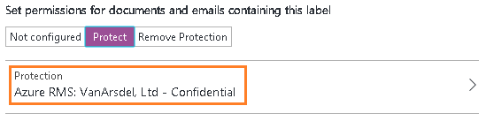

# 步骤 2：配置并发布 Azure 信息保护策略

>适用于：Azure 信息保护

尽管 Azure 信息保护附带了你无需进行配置的默认策略，我们仍然要看一下该策略并进行一些更改。

1. 在新浏览器窗口中，以租户的全局管理员身份或安全管理员身份登录到 [Azure 门户](https://portal.azure.com)。

2. 在中心菜单上，单击“新建”，然后从 **MARKETPLACE** 列表中选择“安全 + 标识”。 在“安全 + 标识”边栏选项卡中，从 **FEATURED APPS** 列表中选择“Azure 信息保护”。 在“Azure 信息保护”边栏选项卡中，单击“创建”。

    这将为租户激活该服务并创建“Azure 信息保护”边栏选项卡，以便下次登录门户时，可以从中心的“更多服务”列表中选择该服务。 

    > [!TIP] 
    > 选择“固定到仪表板”以便在仪表板上创建“Azure 信息保护”磁贴，这样，下次登录到门户时，就可以跳过浏览到该服务。

3. 注意：首次连接到该服务时，系统将自动打开“快速入门”页上的信息。 你可以稍后返回到此信息。 在本教程中，单击“全局策略”以打开“策略: 全局”边栏选项卡。 此边栏选项卡将自动打开，以便执行后续连接到服务的操作，它将显示自动为租户创建的默认信息保护策略：
    
    - 用于分类的标签：“个人”、“公共”、“常规”、“机密”和“高度机密”。 最后两个标签可展开以显示子标签：“所有员工”和“任何人(不受保护)”，并提供有关让类别具有子类别的示例。
    
       > [!NOTE]
       > 你的默认策略可能与本教程中的默认策略稍有不同。 例如，你有名为“内部”的标签，而没有“常规”标签，有“秘密”标签而没有“高度机密”标签。 如果是这种情况，则可能使用的是较旧版本的默认策略。 或者在开始本教程之前，已自行对其进行编辑。
       > 
       > 如果你的默认策略不同，仍可使用本教程，但使用其中的说明和图片时，应注意这些更改。 如果要修改自己默认策略以符合当前的默认策略，请参阅[默认 Azure 信息保护策略](../deploy-use/configure-policy-default.md)。

    - 在默认配置中，某些标签未配置视觉标记（例如页脚、页眉、水印），并且这些标签都没有设置保护： 
    
    
    
    此外，未设置某些策略设置。 例如，并非所有文档和电子邮件都需要标签，没有默认标签，以及用户更改标签时无需提供理由：
    
    

## 更改默认标签和有关提示用户提供理由的设置

在本教程中，将更改几个策略设置，以便可以看到它们的工作原理：

1. 对于“选择默认标签”，将其设置为“常规”。 

    如果因使用旧版本的策略而不具有此标签，请选择“内部”作为等效标签。

2. 对于“用户必须提供理由以设置较低分类标签、删除标签或删除保护”，将其设置为“开”。

## 配置保护的标签、水印和分类提示的条件

现在将更改其中一个子标签的设置，即“机密”主标签中的“所有员工”。 

如果因使用旧版本的策略而导致“机密”标签不具有子标签，则可以改用“机密”标签。 配置步骤相同，但标签边栏选项卡的名称将是“机密”，而不是“所有员工”。

1. 请确保“机密”标签已展开，然后从该标签选择“所有员工”。
    
    在新的“标签: 所有员工”边栏选项卡中，将看到可用于每个标签的设置。 

2. 读取此标签的“说明”文本。 该文本描述应如何使用所选标签，并显示为一个工具提示，帮助用户确定要选择的标签。

3. 找到“为包含此标签的文档和电子邮件设置权限”部分，并选择“保护”：
    
     
    
    此操作将打开“保护”边栏选项卡。
    
3. 在“保护”边栏选项卡中，请务必选中“Azure RMS”，并选中“选择预定义模板”。 然后，单击下拉列表框并选择默认模板，以便组织中的所有用户可以查看和编辑受保护的内容。 
    
    如果你最近已激活 Azure 权限管理服务，此模板会被命名为“机密\所有员工”。 
    
    如果在开始本教程前已经激活 Azure 权限管理服务，默认模板可能会被命名为“\<你的组织名称> - 机密”。 例如，如果你的组织名称为 VanArsdel, Ltd，你会看到并选择“VanArsdel, Ltd - 机密”： 
    
    
    
    如果禁用了此默认 Azure 权限管理模板，请选择替代模板。 但是，如果你选择部门模板，请确保你的帐户包含在范围内。
    
4. 单击“确定”保存所做的更改，这将关闭“保护”边栏选项卡。 自己的配置会通过“标签: 所有员工”边栏选项卡反映出来：
    
    
    
5. 在“标签: 所有员工”边栏选项卡上，找到“设置可视标记”部分：
    
    对于“使用该标签的文档具有一个水印”设置：单击“开”，然后在“文本”框中键入你的组织名称。 例如 **VanArsdel, Ltd**： 
    
    
    
    尽管你可以更改水印的大小、颜色和布局，但是我们将暂时使用这些默认值。
    
6. 定位到“配置条件以自动应用该标签”部分：
    
    单击“添加新的条件”，然后在“条件”边栏选项卡中选择以下选项：
    
    a. “选择条件类型”：保留默认设置“内置”。
    
    b。 “选择内置”：从下拉列表中，选择“信用卡号”。
    
    c. “最小出现次数” ：保留默认值“1”。
    
    d. “仅计算唯一值的发生次数”：保留默认设置“关闭”。
    
    
    
    单击“保存”返回到“标签: 所有员工”边栏选项卡。

7. 在“标签: 所有员工”边栏选项卡中，会看到“信用卡卡号”显示为“CONDITION NAME”，“OCCURRENCES”为“1”：
    
    

8. 对于“选择应用此标签的方式”：保留默认设置“推荐”，并且不要更改默认策略提示：
    
    

9. 在“输入内部管理的注释”框中，键入“仅用于测试”：
    
    

10. 在此“标签: 所有员工”边栏选项卡上，单击“保存”。 然后在“策略: 全局”边栏选项卡上，再次单击“保存”。
    
    此时，标签显示针对刚配置的标签的 Azure RMS 保护：

    
    
    根据对默认标签的更改和更改理由配置设置：
    
    
    
11. 现在我们做出了更改并进行了保存，我们想要将其提供给用户，因此请在初始“Azure 信息保护”边栏选项卡上单击“发布”，然后单击“是”以确认。

    

完成本教程后你可以关闭 Azure 门户，或将其保留为打开状态以尝试其他配置选项。

现在你已经了解了默认策略并进行了一些更改，下一步是安装 Azure 信息保护客户端。

|如果你想了解更多信息|其他信息|
|--------------------------------|--------------------------|
|有关策略的配置选项|[配置 Azure 信息保护策略](../deploy-use/configure-policy.md)|

>[!div class="step-by-step"]
[&#171; 步骤 1](infoprotect-tutorial-step1.md)
[步骤 3 &#187;](infoprotect-tutorial-step3.md)

[!INCLUDE[Commenting house rules](../includes/houserules.md)]