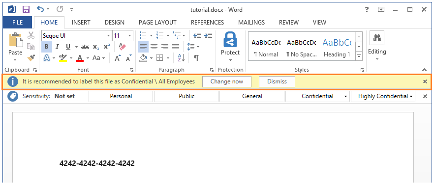

# 步骤 4：查看分类、设置标签和保护的实际操作 

>适用于：[Azure 信息保护](https://azure.microsoft.com/pricing/details/information-protection)

既然已安装 Azure 信息保护客户端，并打开了 Word 文档，就可以知道使用我们配置的策略开始为文档设置标签并保护文档有多么简单。

保存文档后便会启用分类和保护。 但在我们执行此操作前，我们将使用未保存的文档，了解如何轻松应用和更改标签。

## 手动更改默认标签

在信息保护栏上，选择最后一个标签，然后可看到子标签是如何排列的：

选择其中任一子标签，将看到其他标签如何不再显示在栏上，因为已为本文档选择标签。 “敏感级别”值将更改，以显示标签和子标签名称，标签颜色也会相应更改。 例如：

在信息保护栏上，单击当前所选标签值旁边的“编辑标签”图标：

将再次显示可用的标签。

现在，选择第一个标签：“个人”。 由于所选标签的分类低于之前为此文档选择的标签分类，因此将会看到阐明为什么要降低分类级别的提示：

选择“不再应用以前的标签”，然后单击“确认”。 “敏感度”值将更改为“个人”，其他标签将再次隐藏。

## 完全删除分类

在信息保护栏上，再次单击“编辑标签”图标。 不要选择某个标签，而是单击“删除标签”图标：

系统提示时，这一次请键入“此文档不需要分类”，然后单击“确认”。  

可看到“敏感度”值显示为“未设置”（这是在未设置默认标签时用户最初看到的内容）。

## 查看标签和自动保护的推荐提示

1. 在 Word 文档中，键入有效的信用卡号，例如：**4242-4242-4242-4242**。 

2. 使用任意文件名在本地保存文档。 

3. 现在，检测到信用卡卡号时，将看到一条提示，提示用户使用针对保护配置的标签。 如果不同意这条建议，可通过选择“忽略”来拒绝这一建议。 提供建议同时允许用户重写，可帮助减少使用自动分类时的误报。 在本教程中，请单击“立即更改”。

    

    此时，除了表明已应用所配置标签（例如“机密\财务”）的文档外，还可立即在整个页面上看到组织名称的水印，并且还应用了页脚“分类为机密”。 

    该文档还受到为此标签指定的权限的保护。 单击“文件”选项卡可以确认文档是否处于受保护状态，然后查看“保护文档”的信息。 看到该文档受“机密\财务”的保护以及标签说明。 
    
    由于标签的保护配置，只有员工可以打开该文档，且其某些操作受限。 例如，因为他们没有打印、复制和提取内容权限，所以无法打印文档或从中复制内容。 这样的限制有助于防止数据丢失。 作为文档所有者，你可以打印它并从中进行复制。 但是，如果你将该文档以电子邮件的形式发送给组织中的其他用户，他们将无法执行这些操作。

4. 现在可以关闭此文档。

现在你已经在实际操作中了解了分类、标记和保护，我们来看看已在另一组织中与其他人共享你的文档的情况下，如何保护你的文档。 你甚至可以跟踪它们的使用方式，并撤销对它们的访问权限。

|如果你想了解更多信息|其他信息|
|--------------------------------|--------------------------|
|有关标记和保护文件的完整说明 |[对文件或电子邮件进行分类和保护](./rms-client/client-classify-protect.md)|
|记录标记活动的位置 |[Azure 信息保护客户端的使用情况日志记录](./rms-client/client-admin-guide-files-and-logging.md#usage-logging-for-the-azure-information-protection-client)|

>[!div class="step-by-step"]
[« 步骤 3](infoprotect-tutorial-step3.md)
[步骤 5 »](infoprotect-tutorial-step5.md)
