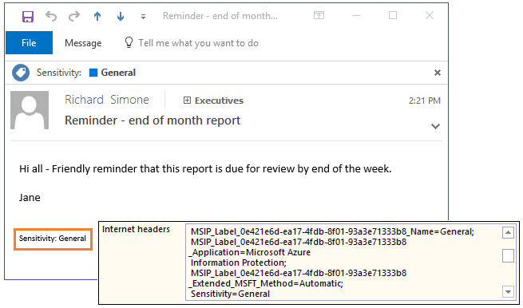

# 什么是 Azure 信息保护？

>适用于：Azure 信息保护

Azure 信息保护是基于云的解决方案，可帮助组织对其文档和电子邮件进行分类、添加标签和保护。 这可以由定义规则和条件的管理员自动进行、由用户手动进行或是组合进行（在这种情况下会向用户提供建议）。 

下图显示实际操作中的 Azure 信息保护示例。 管理员配置了规则来检测敏感数据（在此例中是信用卡信息）。 当用户保存包含信用卡信息的 Word 文档时，她会看到一个自定义工具提示，建议她应用管理员配置的特定标签。 该标签可对文档进行分类并（可选）根据配置进行保护。 

内容进行分类（以及保护（可选））之后，随后可以跟踪并控制其使用方式。 可以分析数据流以深入了解业务、检测危险行为和采取修正措施、跟踪对文档的访问、防止数据泄露或误用，等等。

## 标签如何应用分类

可使用 Azure 信息保护标签对文档和电子邮件应用分类。 执行此操作时，分类在任何时候都是可识别的，无论数据的存储位置在哪或者与谁共享数据。 标签包括可视化标记，如页眉、页脚或水印。 元数据以明文形式添加到文件和电子邮件标头。 明文形式确保其他服务（如数据丢失防护解决方案）可以识别分类并执行相应的操作。 

例如，下面的电子邮件已分类为“常规”。 此标签作为页脚添加到电子邮件。 此页脚是所有收件人的一个可视指示器，它用于一般业务数据，不应在组织外部发送。 该标签也嵌入在电子邮件标头中，以便电子邮件服务可以检查此值并且可以创建审核项或阻止在组织外部发送它。

## 如何保护数据

保护技术使用 Azure Rights Management（通常缩写为 Azure RMS）。 此技术已与其他 Microsoft 云服务和应用程序（例如 Office 365 和 Azure Active Directory）集成。 它还可与你自己的业务线应用程序和软件供应商提供的信息保护解决方案搭配使用，无论这些应用程序和解决方案是在本地还是在云中。

此保护技术使用加密、标识和授权策略。 与应用的标签类似，使用权限管理能够始终为文档和电子邮件提供保护，而不受其位置的影响 – 不管是在组织、网络、文件服务器和应用程序的内部还是外部。 此信息保护解决方案让你可以始终控制你的数据，即使在这些数据与他人共享时也是如此。

例如，可以配置报告文档或销售预测电子表格，以便仅允许组织内人员进行访问，并且可以控制是否可以编辑该文档、是否将其限制为只读，以及是否禁止打印它。 同样，你也可以配置电子邮件，并禁止转发电子邮件或使用“全部答复”选项。 

这些保护设置可以是标签配置的一部分，这样用户就只需应用标签即可分类并保护文档和电子邮件。 不过，支持保护的应用程序和服务也可以使用相同的保护设置，但不能应用标签。 对于这些应用程序和服务，保护设置以 Rights Management 模板形式提供。

### Rights Management 模板

在激活 Azure Rights Management 服务之后，便会为你提供两个默认模板，用于将数据访问权限限制为你组织内的用户。 可以使用这些模板立即帮助防止从你的组织泄露数据。 你还可以通过配置应用更多限制性控件的自己的保护设置来补充这些默认模板。

事实上，针对包含保护设置的 Azure 信息保护创建标签时，此操作会创建相应的 Rights Management 模板。 然后，还可将该模板用于支持 Azure Rights Management 的应用程序和服务。

例如，可从 Exchange 管理中心配置 Exchange Online 邮件流规则来使用这些模板：

有关 Azure Rights Management 保护的详细信息，请参阅[什么是 Azure Rights Management？](what-is-azure-rms.md)

## 与文档和电子邮件的最终用户工作流集成

安装 Azure 信息保护客户端时，Azure 信息保护会与最终用户的现有工作流集成。 此客户端会将信息保护栏安装到 Office 应用程序（如在 Word 中显示此栏的第一张图片所示）。 相同的信息保护栏会添加到 Excel、PowerPoint 和 Outlook。 例如：

此信息保护栏使最终用户能够轻松选择用于正确分类的标签。 如有需要，还可以自动应用标签以避免用户猜测，或者用于遵循组织策略。

若要对其他文件类型进行分类和保护，并想要一次性支持多个文件，用户可在 Windows 文件资源管理器中右键单击文件或文件夹：

如果用户在文件资源管理器中选择“分类和保护”菜单选项，那么他们可以选择一个标签，操作方式类似于他们在 Office 桌面应用程序中使用信息保护栏。 如果需要，他们还可以设置自己的自定义权限。

高级用户（和管理员）可能会发现，针对管理和设置多个文件的分类和保护，使用 PowerShell 命令更有效。 虽然也可以单独安装 PowerShell 模块，但完成这些操作的 PowerShell 命令会自动包含在此客户端中。

文档受到保护后，用户和管理员可以使用文档跟踪站点监视访问这些文档的人员和时间。 如果他们怀疑存在误用，还可以撤销对这些文档的访问权限：

### 其他电子邮件集成

如果将 Azure 信息保护用于 Exchange Online，还可获得其他好处：可将受保护电子邮件发送到任何用户，他们可在任何设备上阅读电子邮件。

例如，用户需要将敏感信息发送到使用 Gmail、Hotmail 或 Microsoft 帐户的个人电子邮件帐户。 或者，向在 Office 365 或 Azure AD 中没有帐户的用户发送敏感信息。 这些电子邮件应静态加密并在传输中加密，且只有原始收件人才能阅读。

此方案需要[ Office 365 邮件加密中的新功能](https://techcommunity.microsoft.com/t5/Security-Privacy-and-Compliance/Email-Encryption-and-Rights-Protection/ba-p/110801)。 如果收件人在本机电子邮件客户端中无法打开受保护的电子邮件，可以使用一次性密码，通过浏览器阅读敏感信息。

例如，Gmail 用户在电子邮件中看到以下信息：

对于发送电子邮件的用户，他们的工作流与将受保护电子邮件发送到其组织内的用户相同。 例如，他们可以选择“不要转发”按钮，Azure 信息保护客户端可以将该按钮添加到 Outlook 功能区。 或者，此“不要转发”功能可以集成到用户选择的标签，使电子邮件分类并受到保护：

或者，可以通过使用应用权限保护的邮件流规则，为用户自动提供保护。 

将 Office 文档附加到这些电子邮件时，这些文档也会自动受到保护。

## Azure 信息保护的资源

- 免费试用版：[企业移动性 + 安全性 E5](https://portal.office.com/Signup/Signup.aspx?OfferId=87dd2714-d452-48a0-a809-d2f58c4f68b7)

- 下载客户端：[Azure 信息保护客户端](https://www.microsoft.com/en-us/download/details.aspx?id=53018)

- 下载可自定义用户指南：[Azure Information Protection End User Adoption Guide](https://download.microsoft.com/download/7/1/2/712A280C-1C66-4EF9-8DC3-88EE43BEA3D4/Azure_Information_Protection_End_User_Adoption_Guide_EN_US.pdf)（Azure 信息保护最终用户采用指南）

- 常见问题：[Azure 信息保护的常见问题](../get-started/faqs.md)

- Yammer：[Azure 信息保护](https://www.yammer.com/AskIPTeam)

此外，Microsoft Ignite 2017 具有将针对 Azure 信息保护按需提供的许多会话。 有关该会议公告的摘要，请参阅 [What’s new in Azure Information Protection @ Ignite 2017](https://cloudblogs.microsoft.com/ENTERPRISEMOBILITY/2017/09/27/whats-new-in-azure-information-protection-ignite-2017/)（Azure 信息保护中的新增功能 @ Ignite 2017）。 

可以前往 Ignite 网站[搜索并查找](https://myignite.microsoft.com/videos?q=%2522azure%2520information%2520protection%2522)标记有 Azure 信息保护的会话。 但建议从以下会话开始：

- [Protecting complete data lifecycle using Microsoft information protection capabilities](https://myignite.microsoft.com/videos/55397)（使用 Microsoft 信息保护功能保护完整的数据生命周期）

- [Accelerate Azure information protection deployment and adoption](https://myignite.microsoft.com/videos/53454)（促进 Azure 信息保护的部署和使用）

- [Discover what’s new in Azure Information Protection and learn about the roadmap and strategy](https://myignite.microsoft.com/videos/53453)（发现 Azure 信息保护中的新增功能并了解相关路线图和策略）

- [Encryption key management strategies for compliance](https://myignite.microsoft.com/videos/53455)（符合性加密密钥管理策略）

- [Protect and control your sensitive emails with new Office 365 Message Encryption capabilities](https://myignite.microsoft.com/videos/53230)（使用 Office 365 邮件加密功能保护和控制敏感的电子邮件）

## 后续步骤

阅读博客文章 [Azure Information Protection: Ready, set, protect!](https://cloudblogs.microsoft.com/enterprisemobility/2017/02/21/azure-information-protection-ready-set-protect/)（Azure 信息保护：准备、设置、保护！）

可通过观看我们的 5 步骤[快速入门教程](../get-started/infoprotect-quick-start-tutorial.md)，配置和使用 Azure 信息保护。 或如果已准备好为组织部署此服务，请参阅 [Azure 信息保护部署路线图](../plan-design/deployment-roadmap.md)。

或许你是通过其他名称了解的 Azure 信息保护？ 请参阅[该服务的替代术语列表](azure-rms-aka.md)。

[!INCLUDE[Commenting house rules](../includes/houserules.md)]
